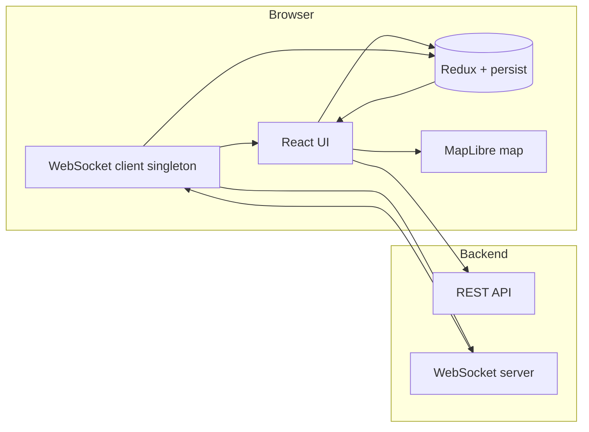

# spotly-fe

Frontend for **spotly.** — a location-aware social product summarized in the app as *“Meet people around you.”* This repository is a single-page application (SPA) built with React. Users land on a marketing site, sign up or sign in, complete onboarding, then use a **MapLibre** map to see **nearby people** updated in near real time over **WebSockets**, alongside UI rails for utilities and (planned) chat.

---

## Table of contents

1. [What this project does](#what-this-project-does)
2. [Goals and product intent](#goals-and-product-intent)
3. [Tech stack](#tech-stack)
4. [How to run it locally](#how-to-run-it-locally)
5. [Environment variables](#environment-variables)
6. [Architecture overview](#architecture-overview)
7. [Routing and navigation](#routing-and-navigation)
8. [Authentication and API layer](#authentication-and-api-layer)
9. [Real-time layer (WebSockets)](#real-time-layer-websockets)
10. [Map and nearby users](#map-and-nearby-users)
11. [State management (Redux)](#state-management-redux)
12. [Validation](#validation)
13. [Project layout (`src/`)](#project-layout-src)
14. [Scripts](#scripts)
15. [Known integration notes and caveats](#known-integration-notes-and-caveats)

---

## What this project does

| Area | Behavior |
|------|-----------|
| **Landing (`/`)** | Marketing sections (hero, how it works, safety, etc.) and auth modals for sign-in / sign-up. |
| **Auth** | Email/password against a REST API; successful responses store the JWT and user profile in Redux and navigate to `/home`. |
| **Onboarding** | Multi-step flow (join reason → profile info → avatar → location permission) backed by `PUT` endpoints under `/onboarding/*`. |
| **Home (`/home`)** | Protected shell: utility rail, optional chat sidebar layout, and a full-screen map. Sends WebSocket `auth` after connect; receives nearby-user events and renders markers. |
| **Location** | After the server acknowledges auth (`auth:success`), the client reads **one** GPS fix via the browser Geolocation API and sends `location:update` over the same WebSocket. |

---

## Goals and product intent

- **Discovery by proximity**: The primary experience is seeing who is around you on a map, not scrolling an anonymous feed.
- **Live presence**: Nearby roster is meant to stay fresh via WebSocket pushes (`nearby:users`, enter/leave) rather than constant polling.
- **Trust and profile**: Onboarding collects reasons for joining, profile fields, avatar, and explicit location permission — aligning server-side state with what the map needs.
- **Polished shell**: The home layout separates persistent controls (utility rail), conversational UI (sidebar placeholder), and the dominant map surface.

---

## Tech stack

| Layer | Choice |
|-------|--------|
| UI | React 19, TypeScript (strict) |
| Build | Vite 7 |
| Styling | Tailwind CSS 4 (`@tailwindcss/vite`) |
| Routing | React Router 7 (`createBrowserRouter`) |
| Global state | Redux Toolkit + **redux-persist** (partial persistence — see below) |
| HTTP | Axios (`withCredentials: true` for cookie-aware auth refresh) |
| Map | MapLibre GL + MapTiler-hosted styles (API key required) |
| Real-time | Browser `WebSocket`, singleton client with exponential backoff reconnect |
| Forms / validation | Zod schemas + small hooks |

---

## How to run it locally

**Prerequisites**

- Node.js compatible with the versions implied by `package.json` (modern LTS recommended).
- A running **backend** that implements the API and WebSocket contracts this app expects (see sections below). Without it, auth and live features will fail; the map may still render if MapTiler is configured.

**Steps**

```bash
npm install
# Create .env in the project root — see Environment variables
npm run dev
```

Vite serves the app (default `http://localhost:5173`). Open that URL in a browser.

**Production build**

```bash
npm run build
npm run preview   # optional local preview of dist/
```

---

## Environment variables

Vite exposes only variables prefixed with `VITE_`. Create a `.env` file in the project root (do not commit secrets).

| Variable | Required | Purpose |
|----------|----------|---------|
| `VITE_API_URL` | Recommended | REST API base URL (default in code: `http://localhost:8080/api`). |
| `VITE_WEBSOCKET_API_URL` | Required for live features | Full WebSocket URL (e.g. `ws://localhost:8080/ws` — exact path depends on your backend). If unset or empty, the client disconnects and stays disconnected. |
| `VITE_MAPTILER_API_KEY` | Required for basemap tiles | MapTiler API key appended to MapLibre style URLs in `src/components/Map/mapStyles.ts`. Without it, requests may fail or return errors depending on MapTiler policy. |

Example shape (values are illustrative):

```env
VITE_API_URL=http://localhost:8080/api
VITE_WEBSOCKET_API_URL=ws://localhost:8080/your-ws-path
VITE_MAPTILER_API_KEY=your_maptiler_key
```

---

## Architecture overview

High-level data flow:



1. **REST** handles signup, signin, onboarding steps, signout, and token refresh.
2. **Redux** holds auth token (memory-only), user profile, availability toggle, and optional WebSocket-derived data.
3. **WebSocket** connects only when a token exists and `VITE_WEBSOCKET_API_URL` is set. Incoming JSON messages are parsed, broadcast on an internal event bus, and some events update Redux or trigger handlers (e.g. location upload).

---

## Routing and navigation

Defined in `src/routes.tsx`:

| Path | Component | Notes |
|------|-----------|-------|
| `/` | `Landing` | Marketing page; `?login=true` opens the login modal (used when redirecting unauthenticated users from `/home`). |
| `/home` | `Home` wrapped in `ProtectedRoute` | Requires `state.user.user` in Redux; otherwise redirect to `/?login=true`. |
| `/onboarding/join-reason` | `JoinReason` | Step 0 |
| `/onboarding/profile-info` | `ProfileInfo` | Step 1 |
| `/onboarding/profile-image` | `ProfileImage` | Step 2 |
| `/onboarding/location-permission` | `LocationPermission` | Step 3 |

**Onboarding enforcement**: `Home` inspects `user.onboardingStatus`, `user.onboardingStep`, and `user.location_permission`. Incomplete onboarding or missing location permission navigates to the appropriate onboarding route.

---

## Authentication and API layer

**Axios instance** (`src/api/axios.ts`)

- `baseURL`: `VITE_API_URL` or default `http://localhost:8080/api`.
- `withCredentials: true` — cookies are sent (used for refresh-token style flows).
- Request interceptor: attaches `Authorization: Bearer <token>` from `state.token` when present; sets `Content-Type` for JSON unless the body is `FormData`.
- Response interceptor: on `401`, attempts `POST /auth/refresh` via a separate Axios instance, then retries the original request. Clears token and user if refresh fails. Paths matching `/auth/signin`, `/auth/signup`, `/auth/refresh` skip this retry logic.

**Auth service** (`src/api/services/authService.ts`)

- `POST /auth/signup`
- `POST /auth/signin`
- `POST /auth/signout`

**Onboarding service** (`src/api/services/onboardService.ts`)

- `PUT /onboarding/join-reason` — `{ reason }`
- `PUT /onboarding/profile-info` — name, gender, DOB, optional bio
- `PUT /onboarding/avatar` — `FormData` upload
- `PUT /onboarding/location-permission` — `{ permission }`

Successful sign-in/sign-up responses are expected to include at least `token` and `user` (see `logIn.tsx` dispatch shape).

---

## Real-time layer (WebSockets)

**Connection lifecycle** (`src/ws/WebSocketContext.tsx`)

- Subscribes to Redux `token`.
- If `VITE_WEBSOCKET_API_URL` or token is missing → disconnect.
- Otherwise connects `wsClient`, registers `onMessageHandler`, updates `isConnected` for context consumers.

**Singleton client** (`src/ws/wsClient.ts`)

- One socket per tab.
- Parses outgoing payloads with `JSON.stringify`.
- On unexpected close, reconnects with exponential backoff (capped at 30 seconds).

**Inbound message shape** (`src/ws-handlers/onMessage.ts`)

Every message is assumed to be JSON:

```json
{ "event": "<string>", "data": <any> }
```

Behavior:

1. **`wsEventBus.emit(event, data)`** — fan-out to React subscribers (`useWsEvent`).
2. **`auth:success`** — runs `locationUpdatesHandler`: `navigator.geolocation.getCurrentPosition` → sends:

   ```json
   {
     "event": "location:update",
     "payload": { "lat": <number>, "lng": <number> }
   }
   ```

3. **`nearby:users`** — `store.dispatch(setNearbyUser(data))` (Redux) and components can also listen via `useWsEvent`.

**Outbound auth from Home** (`src/pages/Home.tsx`)

After the socket is open, once per connection:

```json
{
  "event": "auth",
  "payload": {
    "token": "<jwt>",
    "firstName": "...",
    "lastName": "...",
    "bio": "...",
    "avatarUrl": "...",
    "joinReason": "...",
    "availability": <boolean>
  }
}
```

**Subscribing in components** (`src/ws/useWsEvent.ts`)

Hooks subscribe to named events on `wsEventBus` and unsubscribe on unmount. Example events used on the map: `nearby:users`, `nearby:user:leave`, `nearby:user:enter`.

---

## Map and nearby users

**Rendering**

- `useMapInstance` creates a MapLibre map with a **light** MapTiler streets style, initial center near Lagos (placeholder comment in code suggests replacing with the user’s location).
- `useUserMarkers` mounts React-driven markers (`UserMarker`) as MapLibre `Marker` roots.

**Spiderfy**

When multiple users project to nearly the same screen pixel, `spiderfyLayout.ts` groups overlapping markers and spreads them in a small circle (“spider legs”) so taps remain distinguishable. Thresholds: `SPIDERFY_OVERLAP_THRESHOLD_PX`, `SPIDERFY_LEG_RADIUS_PX`.

**Data normalization**

`NearbyUser` types live in `src/types/map.types.ts`. `normalizeNearbyUser` accepts either `id` or `userId` and string or numeric `lat`/`lng` so minor backend inconsistencies do not break the map.

**Fallback data**

`MapArea` seeds the UI with **mock nearby users** until/replacement by WebSocket payloads — useful for layout work without a server.

---

## State management (Redux)

**Store** (`src/store/store.ts`)

Combined slices: `token`, `user`, `availability`, `wsData`.

**redux-persist**

- **Whitelist**: `user`, `availability` — survives reloads in `localStorage`.
- **Blacklist**: `token` — JWT is **not** persisted; users must sign in again after a full reload unless you change this deliberately.

**Slices (mental model)**

| Slice | Role |
|-------|------|
| `token` | JWT string or `null`. |
| `user` | `{ user: User \| null }` — profile from API (`interfaces.ts`). |
| `availability` | Boolean surfaced in WebSocket `auth` payload. |
| `wsData` | Holds `nearbyUser` for app-wide reads when dispatched from `onMessageHandler` (map UI also merges WS events locally). |

---

## Validation

`src/validationSchemas.ts` defines Zod schemas:

- **Auth**: email + password strength rules (length, mixed case, digit, special character).
- **Profile info**: first name length, optional last name, gender enum, DOB (18+, not future), optional bio length.

Onboarding and auth forms wire these through hooks such as `useAuthValidator` / form-specific validators.

---

## Project layout (`src/`)

| Path | Responsibility |
|------|----------------|
| `main.tsx` | Redux `Provider`, `PersistGate`, global CSS + MapLibre CSS |
| `App.tsx` | `WebSocketProvider`, router, toast host |
| `routes.tsx` | Route table |
| `pages/` | Top-level screens (`Landing`, `Home`, onboarding steps) |
| `components/` | Feature UI (landing sections, auth modals, home shell, map helpers) |
| `api/` | Axios instance and service modules |
| `store/` | Redux store and slices |
| `ws/` | Context, singleton client, event bus, `useWsEvent` |
| `ws-handlers/` | Central inbound WS dispatcher + location handler |
| `hooks/` | Shared hooks (auth validation, WebSocket wrapper, forms) |
| `utils/` | e.g. onboarding route constants and ordering |
| `types/` | Map-related TS types |

---

## Scripts

| Command | Description |
|---------|-------------|
| `npm run dev` | Start Vite dev server with HMR |
| `npm run build` | Typecheck (`tsc -b`) then production bundle |
| `npm run preview` | Serve the built `dist/` |
| `npm run lint` | ESLint over the repo |

---

## Known integration notes and caveats

These are useful when pairing this repo with a backend or onboarding new contributors:

1. **Backend contract is implicit** — Endpoint paths and WebSocket `event` names are encoded in the frontend; there is no generated OpenAPI client here. Treat `authService`, `onboardService`, `onMessageHandler`, and `Home`’s `sendMessage` payload as the contract checklist.

2. **401 refresh handler** — The retry path expects refresh response fields compatible with `setToken` and the retried `Authorization` header. Align backend field names (`token` vs `accessToken`, etc.) with `src/api/axios.ts` or adjust the client.

3. **Geolocation** — Location is sent once per successful `auth:success` (not a continuous watch). Moving users or long sessions may need `watchPosition` or periodic updates on the server contract side.

4. **Protected route checks user, not token** — `ProtectedRoute` reads `state.user.user`. Ensure sign-in always hydrates user in Redux.

5. **Google sign-in button** — Present in UI as a placeholder; wiring depends on a future OAuth flow.

6. **Chat sidebar** — Layout exists; `hasChats` is currently a stub (`useState(true)` in `Home`).

7. **Strict TypeScript** — `tsconfig.app.json` enables strict options including `noUnusedLocals` / `noUnusedParameters`; unused imports and variables fail the build.

---

## License / ownership

This project is marked `"private": true` in `package.json`. Add your organization’s license or usage terms here if you publish or share the repository.
